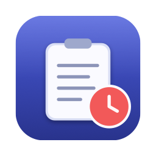
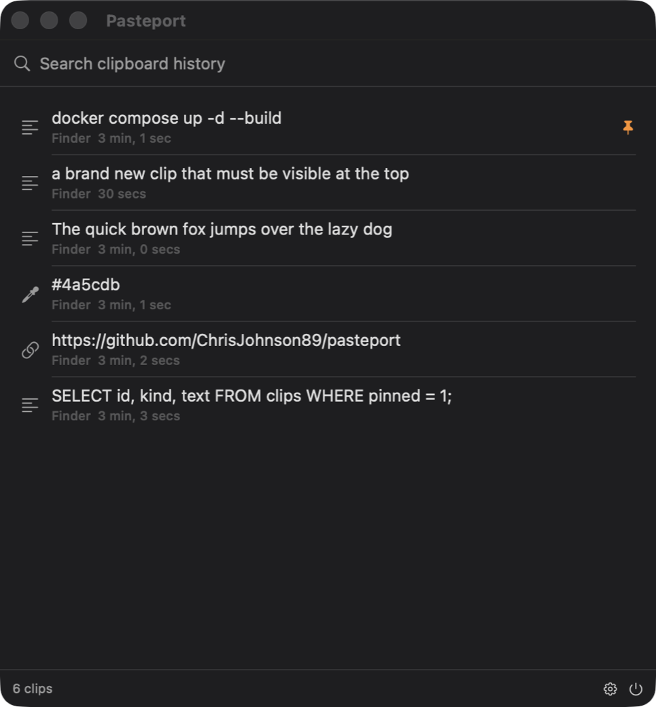

<div align="center">



# Pasteport

**Free clipboard history for macOS and Linux.**
Local-first. No account, no sync server, no telemetry, no paid tier.

[](https://github.com/ChrisJohnson89/pasteport/actions/workflows/ci.yml)
[](https://github.com/ChrisJohnson89/pasteport/releases/latest)
[](LICENSE)



</div>

## Install

**macOS** — [download the latest DMG](https://github.com/ChrisJohnson89/pasteport/releases/latest),
open it, drag Pasteport to Applications.

> First launch is blocked, because the build carries only an ad-hoc signature
> rather than an Apple Developer certificate. Open it once via **System Settings →
> Privacy & Security → Open Anyway**. Once only.

**Linux** — grab the CLI tarball from the same page, or build from source:

```bash
cargo build --release
```

Linux also needs a clipboard helper: `sudo apt install wl-clipboard xclip`.

Building the macOS app yourself:

```bash
./apps/macos/build-app.sh --install
```

## Use

Open the app and start typing. Return copies the highlighted clip back to the
clipboard; right-click for pin and delete. The list updates as you copy.

There is a CLI too:

```bash
pasteport search "api key"
```

Full command list and config options: **[docs/cli.md](docs/cli.md)**.

## What it does

- **Dedup** — copy the same thing twice, get one entry with a bumped count.
- **Typed clips** — text, rich text, links, colors, images, files, all filterable.
- **Full-text search** — SQLite FTS5, and your query is never treated as query
  syntax, so pasting `a AND "b` searches for those characters.
- **Pinboards** — named collections. Pinned clips are never pruned.
- **Retention you control** — age, count, and size limits in one config file.

## Privacy

Clipboard history is one of the most sensitive files on a machine.

- **Password managers are ignored by default** — 1Password, Bitwarden, KeePassXC
  and others.
- **Concealed clips are never read.** Items marked
  `org.nspasteboard.ConcealedType` are detected *before* the payload is fetched,
  so a password never enters the process.
- **Owner-only files.** Data dir `0700`; database, config, and socket `0600`.
- **No network code exists.** No sync, no crash reporting, no update check.

## Free

No license key, no trial, no pro tier. The licensing code was deleted, not
disabled. AGPL-3.0 — read it, patch it, ship your own build. A star is plenty.

## Docs

| | |
|---|---|
| [docs/cli.md](docs/cli.md) | Every command, config file, environment variables |
| [docs/architecture.md](docs/architecture.md) | How it is built and why, with the tradeoffs written down |
| [apps/macos/README.md](apps/macos/README.md) | The macOS app: build, bundle layout, known gaps |

Layout: `pasteport-core` (storage, search, retention) · `pasteport-clipboard`
(NSPasteboard, wl-clipboard, xclip) · `pasteport-daemon` (watcher + socket API) ·
`pasteport-cli` · `pasteport-ffi` (C ABI for SwiftUI) · `pasteport-gtk`.

```bash
cargo test --workspace
```

## Status

0.1.0, early. The engine, service, CLI, and macOS app work and are tested. The
GTK4 front end builds but has had less use.

**No global hotkey yet** — that is the next thing, and it is what will make this
feel fast. Also planned: paste-on-select, launch-at-login, image previews,
notarized releases.

## License

[AGPL-3.0-or-later](LICENSE).
